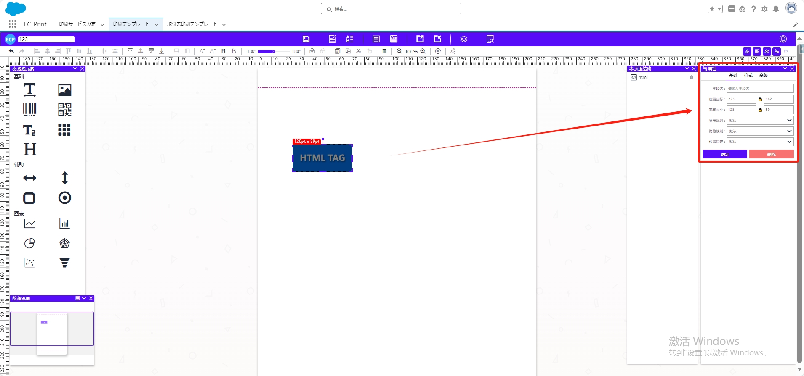
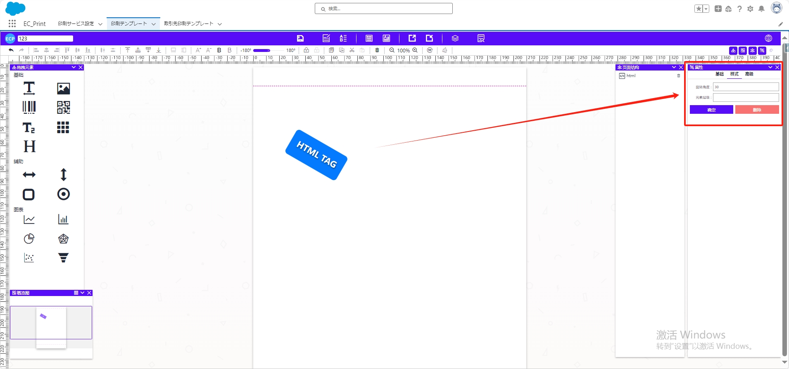
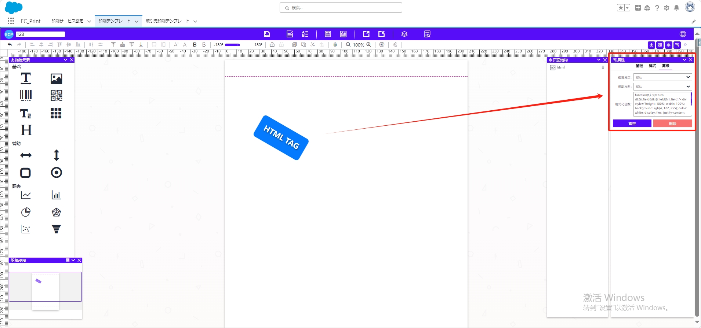

# HTML

## **拖拽与编辑**

- 将拖拽元素【html】拖至中间模板位置。
- **拖动显示区域**调整大小。

## 属性值设置

### 一、基础属性

- **位置坐标、宽度大小：** 调整元素的位置和尺寸。
- **显示规则：** 设置元素的显示规则。
- **隐藏规则：** 指定元素在某些情况下的隐藏位置，比如首页或者尾页隐藏。
- **位置固定：** 设定元素是否固定在某个位置。

### 二、样式属性

- **旋转角度：** 旋转元素的角度。
- **元素层级：** 控制元素在图层中的显示顺序。

### 三、高级属性

- **强制分页：** 控制元素是否强制在页面中单独显示。
- **拖动方向：** 设定元素可拖动的方向。
- **格式化函数：** 定义对拖拽元素进行格式化的函数，编写适当的格式化函数并将其应用于拖拽元素。

