# 云端打印设定方法

## **ec-print 设置指南**

## 打印设置说明

- 启动ec-print，在ec-print中点击设置进入设置页面

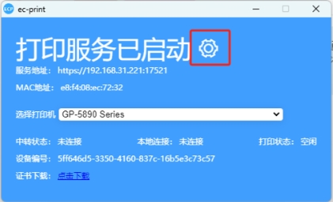
- 在设置页面中，找到语言选项，选择你希望使用的语言。

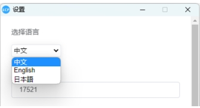
- 定位到端口号设置，输入所需的端口号。确保端口号没有被其他应用程序占用。

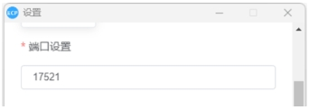
- 在相应字段中输入你想要显示的客户端名称。这通常是在网络中标识你的打印机。

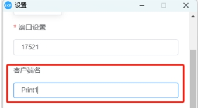
- 如果需要 ec-print 随系统启动而启动，请启用“开机启动”选项。

- 如果希望 ec-print 在启动后最小化到系统托盘，请启用“自启后最小化”选项。

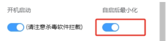
- 如果您使用中转服务，请配置相关选项。这可能包括中转服务的地址、服务器TOKEN(契约ID)等信息。

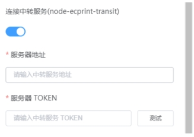
- 要确定是否连接成功，点击测试按钮，进行测试是否连接成功。

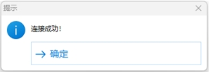
- 确认所有设置都符合你的需求后，记得保存设置，点击应用后弹出窗口，保存后进行重启。

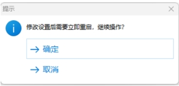
- 重启后，主页面会显示当前设置的客户端名等连接信息

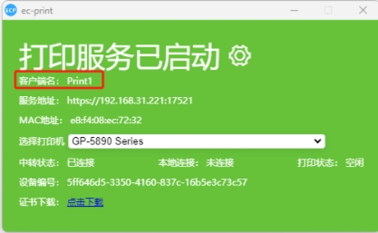
- 如果已连接中转服务，中转状态则显示：已连接

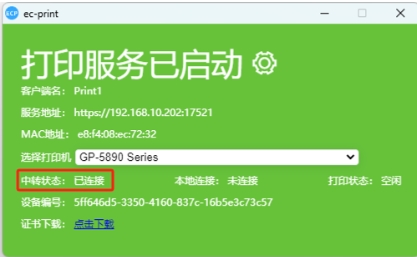
- 打印时，打印状态为打印中，打印结束后变回空闲状态

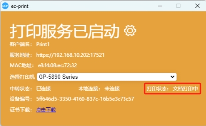
### **注意事项**

- 在设置端口号时，请确保选择一个未被其他应用程序占用的端口。
- 如果使用中转服务，请确保输入正确的服务地址和TOKEN。