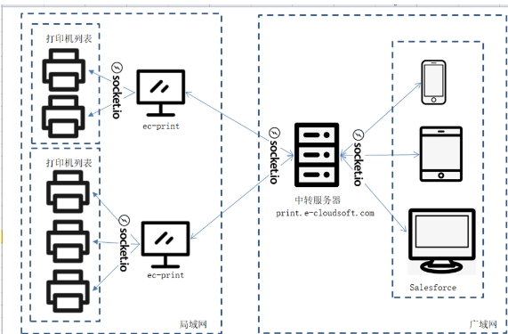

# 常见问题

# 云端打印和本地打印有什么区别？

## **本地打印**

- 打印任务直接发送到本地连接的打印机。计算机与打印机之间的通信在**本地网络**中完成，需要计算机和打印机在同一网络中。
- 适用于需要直接访问特定打印机的场景，但可能不够灵活，尤其在移动设备上。
- 管理通常在本地进行，可能需要专门的管理员来监控和维护打印设备。

## **云端打印**

- 打印任务首先上传到云端服务器，然后由云端服务器将任务发送到用户指定的远程打印机。打印机可以位于**任何地方**，只要它与云服务连接。
- 打印任务需要通过云服务上传到服务器，然后再传输到远程打印机。
- 允许使用各种设备（例如智能手机、平板电脑）通过云服务进行打印，而不需要直接连接到打印机。
- 提供更大的灵活性，允许用户从任何地方发送打印任务，只要有互联网连接。这对于移动办公和远程工作非常方便。
- 云服务通常提供更多的远程管理和监控功能，使管理员能够跟踪打印任务并进行必要的管理操作。

