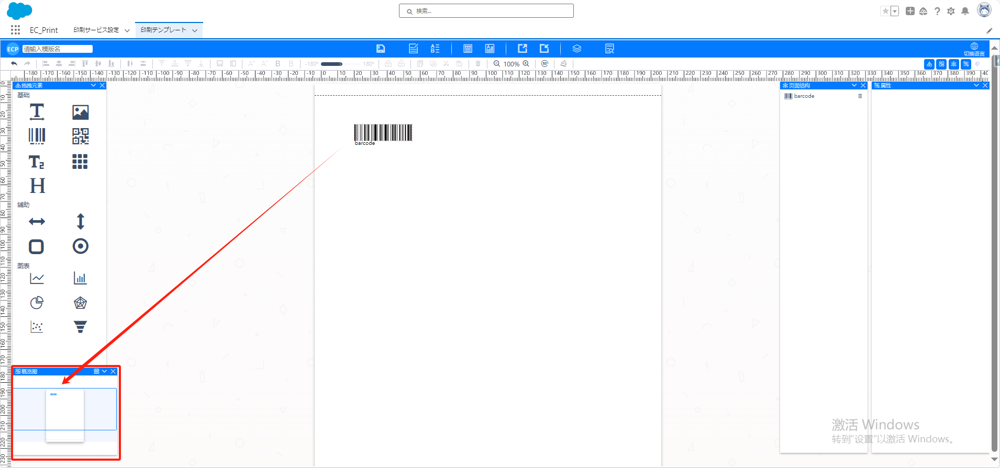

# 开始

## **介绍**

- ec-print 是一款用于设置打印模板组件。用户可以通过 ec-print 设置打印模板，包括模板的字体、颜色、大小、行间距等属性，以及是否旋转等效果。
- 总之，ec-print 是一款功能强大的打印模板设置组件，支持多种打印格式和属性设置。用户可以通过它创建自定义的打印模板，并在需要时进行打印。

## **基本功能描述**

- 1.在打印设置模板页面，用户可以设置模板的字体、颜色、大小、行间距等属性。例如，用户可以更改字体类型、颜色值、字体大小（如 8pt、12pt 等）以及行间距。
- 2.用户还可以选择是否旋转模板（如水平、垂直或旋转 90 度），以及是否翻页（对于多页打印）。例如，用户可以在需要时启用或禁用旋转和翻页功能。
- 3.当用户选择好打印属性并点击“确定”按钮时，ec-print 会创建一个包含用户设置的打印模板。用户可以保存这个模板以便在后续打印时使用。
- 4.如果需要，用户可以在打印预览窗口中调整模板的位置和大小，以确保 printed 内容的正确显示。
- 5.用户可以打印多页文本或条形码模板，或者将它们存储为新的打印模板。

## 快速上手

- 介绍 ec-print 的基本概念和它的主要功能。你将了解到 ec-print 如何帮助你实现高效的文档打印和管理。我们会简要介绍其模块结构，帮助你建立起对工具的整体认识。

### **拖拽元素**

- 用户可以在左侧的可用元素列表中选择要拖拽的元素，然后将其拖拽到主工作区。拖拽元素的过程中，可以查看元素样式

### **概览图**

- 显示主工作区中的元素布局和样式效果。用户可以在概览图中查看当前的设计效果，然后进行相应的调整。

### **主工作区**

- 页面主要区域，用户可以在其中拖拽元素、调整布局和样式。

## **页面结构**

- 显示主工作区中的元素一览，包括元素的类型信息。用户可以查看当前的设计结构和元素布局，可以点击元素后方的删除按钮，将元素删除操作。

## **属性**

- 显示当前选中元素的所有属性，包括基础属性、样式、边框和高级属性等。用户可以在属性面板中查看和修改元素的属性。

## **预览**

- 点击预览按钮，查看当前设计模板下的打印效果。用户可以在预览中查看设计效果，然后进行相应的调整。

## 上方功能栏

- 可以选择保存、编辑模板数据、导出到本地文件、从本地文件导入、查看json数据模型、查看Apex Class数据类型等操作

