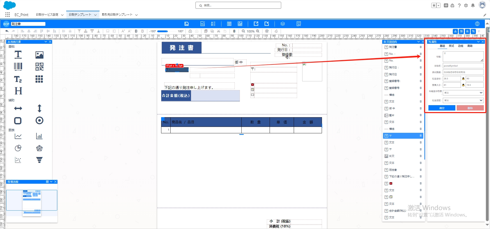
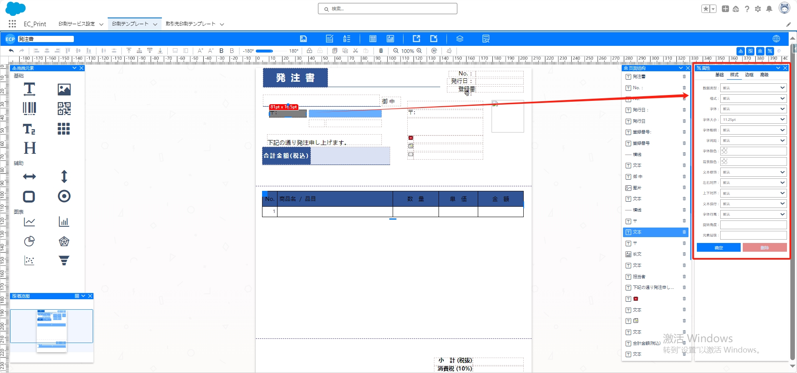
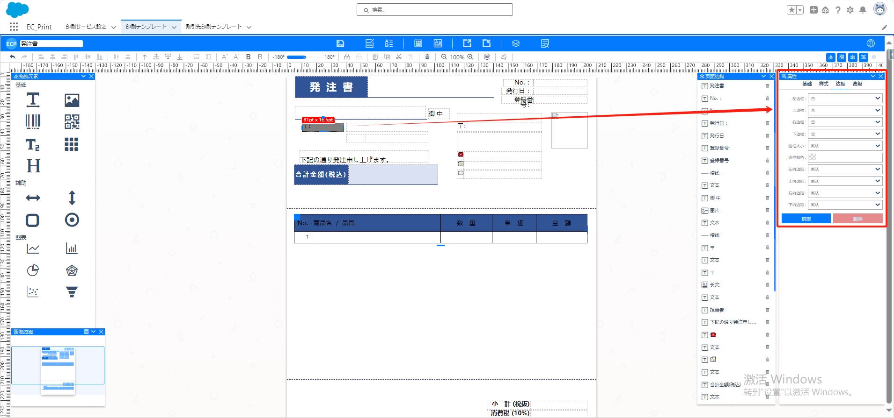
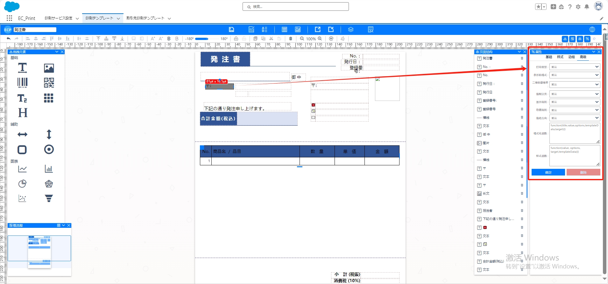

# 文本

<aside>
💡 将拖拽元素【文本】拖拽至中间模板位置，双击文本可以修改文本的内容，点击文本可以进行旋转，文本区域拉长拉高的操作

</aside>

## **拖拽与编辑**

- 将拖拽元素【文本】拖至中间模板位置。
- **双击文本内容**进行编辑。
- **点击文本**进行旋转。
- **拖动文本区域**调整大小。

## 属性值设置

### 一、基础属性

- **标题**：文本显示内容
- **字段名**：文本的字段名称
- **测试数据**：仅在字段命名存在的时候生效
- **坐标位置、宽度大小**：调整文本的坐标位置和宽度大小。

### 二、样式属性

- **数据类型、格式、字体、字体大小、字体粗细、字间距、字体颜色、背景颜色：** 设定文本样式。
- **文本修饰、左右对齐、上下对齐、文本换行、字体行高、旋转角度、元素层级：** 进一步调整文本外观。

### 三、边框属性

- **左边框、上边框、右边框、下边框：** 设置各边框的样式。
- **边框大小、边框颜色：** 调整边框的大小和颜色。
- **左内边距、上内边距、右内边距、下内边距：** 设定文本内容与边框的内边距。

### 四、高级属性

- **打印类型、条形码格式、二维码容错率：** 针对高级打印需求进行设置。
- **强制分页、显示规则、隐藏规则、拖动方向：** 控制文本的特殊属性。
- **格式化函数、样式函教：** 进行高级文本格式化。

