# 本地打印设定方法

## **ec-print 设置指南**

## ec-print证书安装

确保你已成功安装 ec-print 并启动了应用程序。

### 1.证书下载

- 在 ec-print 主界面中，找到并点击“证书下载”选项。

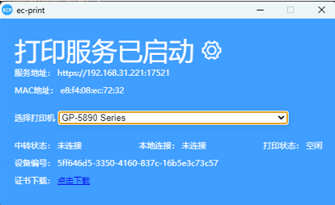
- 进入证书下载页面，点击证书下载，将下载证书保存到本地。

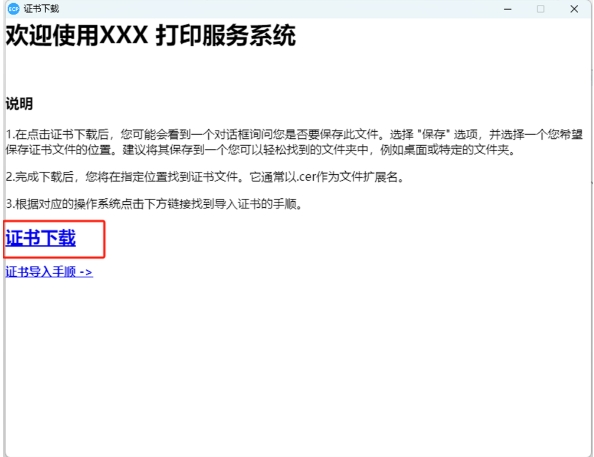
- 在下载证书后，你会得到一个证书文件（是一个 .cer 结尾的文件）。

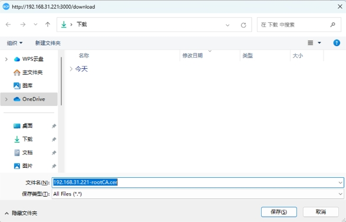
### 2.证书导入

- 双击下载后的证书文件，进行导入证书操作

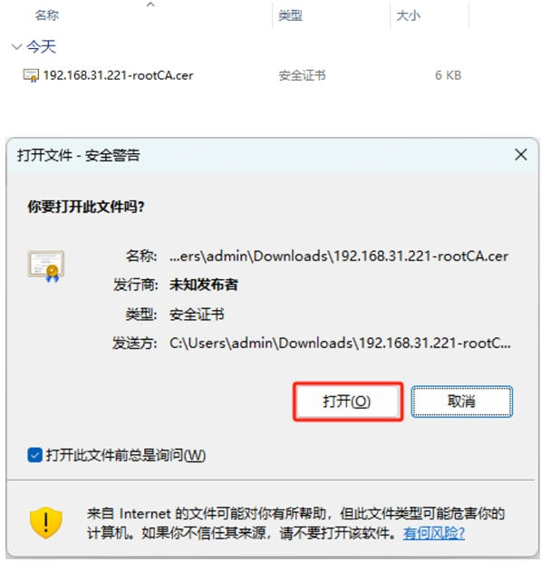

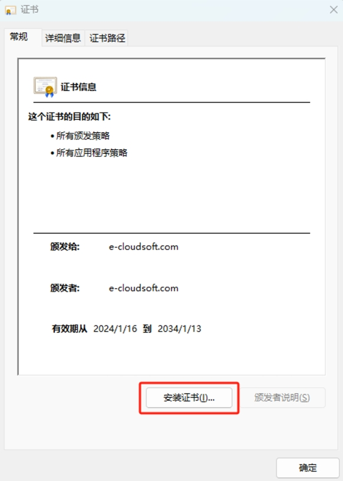
- 根据具体情况选择储存位置

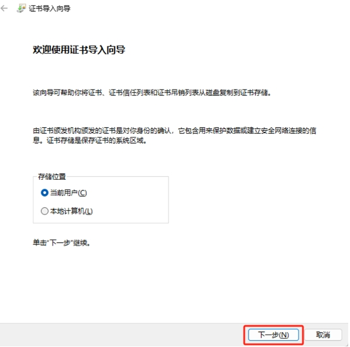
- 选择证书储存的位置，将证书储存到【受信任的根证书颁发机构】中

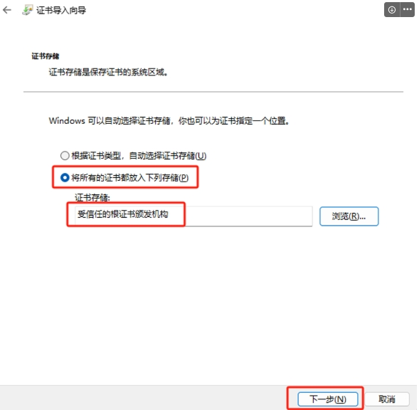
- 点击完成导入成功

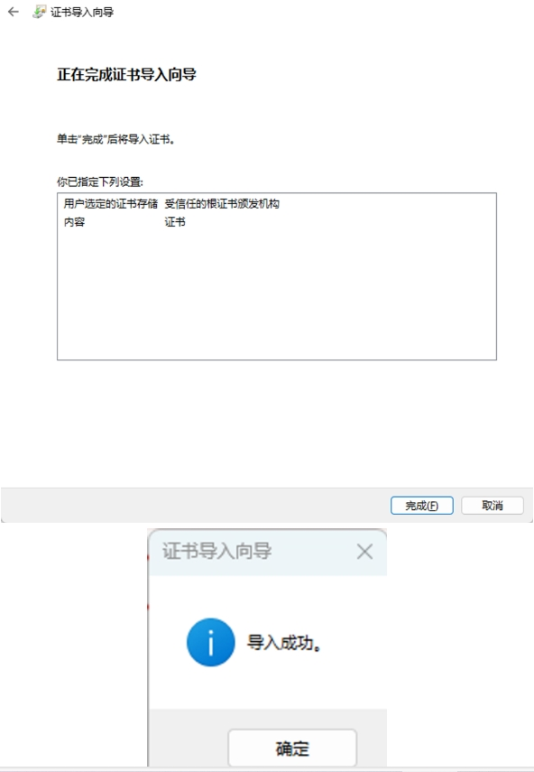
## 打印设置说明

- 启动ec-print，在ec-print中点击设置进入设置页面

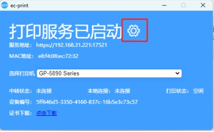
- 在设置页面中，找到语言选项，选择你希望使用的语言。

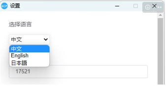
- 定位到端口号设置，输入所需的端口号。默认端口号为17521，确保端口号没有被其他应用程序占用。

- 在相应字段中输入你想要显示的客户端名称。这通常是在网络中标识你的打印服务名称。

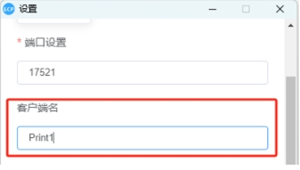
- 如果需要 ec-print 随系统启动而启动，请启用“开机启动”选项。

- 如果希望 ec-print 在启动后最小化到系统托盘，请启用“自启后最小化”选项。

- 如果没有中转服务，请将连接中转服务设置为关闭状态

- 确认所有设置都符合你的需求后，记得保存设置，点击应用后弹出窗口，保存后进行重启。

- 重启后，主页面会显示当前设置的客户端名等连接信息

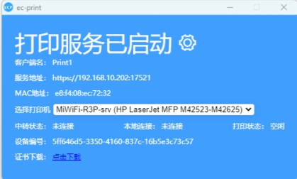
- 如果已有本地连接，本地连接则显示：已建立*条连接

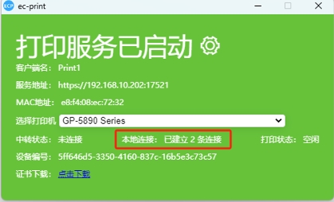
- 打印时，打印状态为打印中，打印结束后变回空闲状态

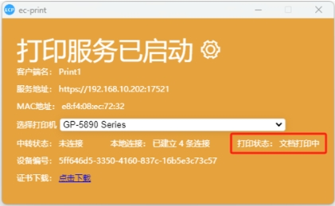
### **注意事项**

- 在设置端口号时，请确保选择一个未被其他应用程序占用的端口。
- 如果使用中转服务，请确保输入正确的服务地址和端口。