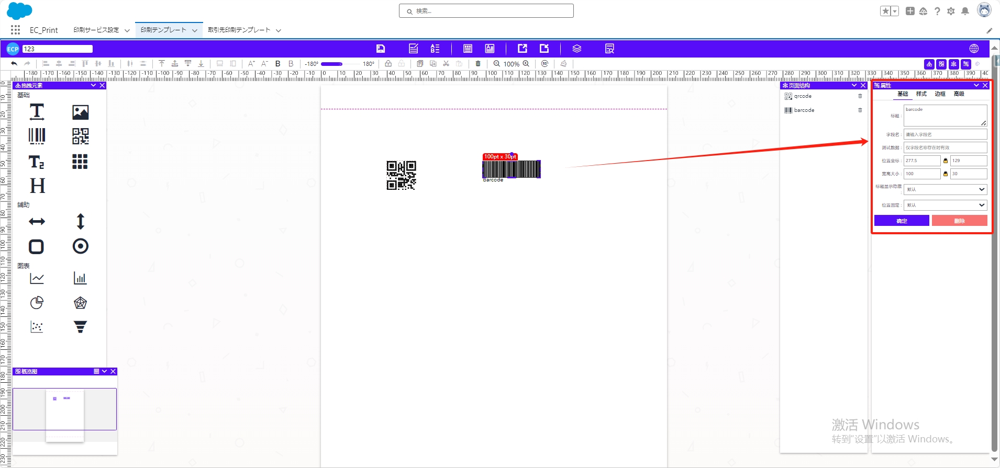
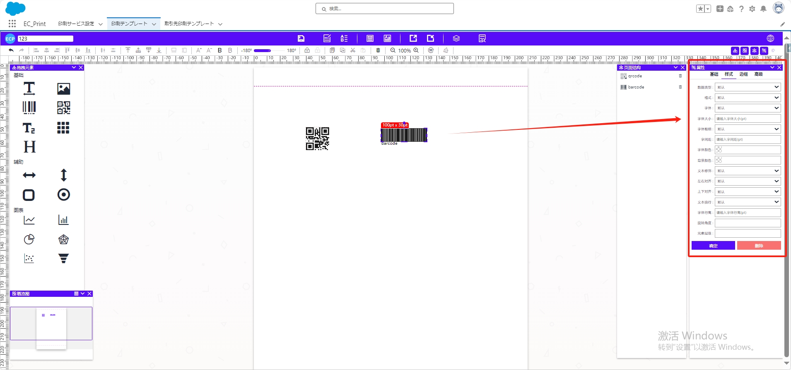
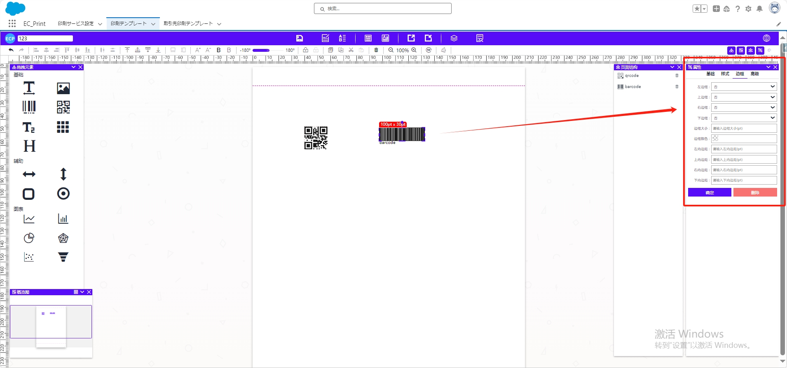
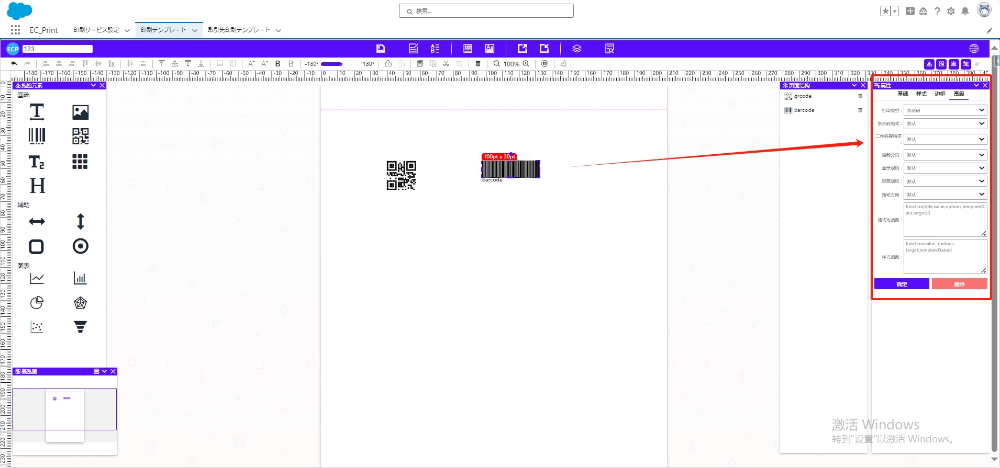

# 条形码&二维码

## **拖拽与编辑**

- 将拖拽元素【条形码】【二维码】拖至中间模板位置。
- **拖动显示区域**调整大小。

## 属性值设置

### 一、基础属性

- **标题**：元素显示内容。
- **字段名**：元素的字段名称。
- **测试数据**：仅在字段命名存在的时候生效
- **坐标位置、宽度大小**：调整元素的坐标位置和宽度大小。
- **标题显示隐藏：**控制标题的显示或隐藏。

### 二、样式属性

- **字体、字体大小、字体粗细：** 设置二维码或条形码元素的字体属性。
- **字间距、字体颜色、背景颜色：** 调整元素的排列间距以及字体和背景颜色。
- **左右对齐、上下对齐：**控制元素在元素中的水平和垂直对齐方式。
- **字体行高、旋转角度、元素层级：**设置元素行高、旋转角度以及元素的图层叠放顺序。

### 三、边框属性

- **左边框、上边框、右边框、下边框：** 设置各边框的样式。
- **边框大小、边框颜色：** 调整边框的大小和颜色。
- **左内边距、上内边距、右内边距、下内边距：** 设定内容与边框的内边距。

### 四、高级属性

- **打印类型、条形码格式、二维码容错率：** 针对高级打印需求进行设置。
- **强制分页、显示规则、隐藏规则、拖动方向：** 控制特殊属性。
- **格式化函数、样式函教：** 进行高级文本格式化。

