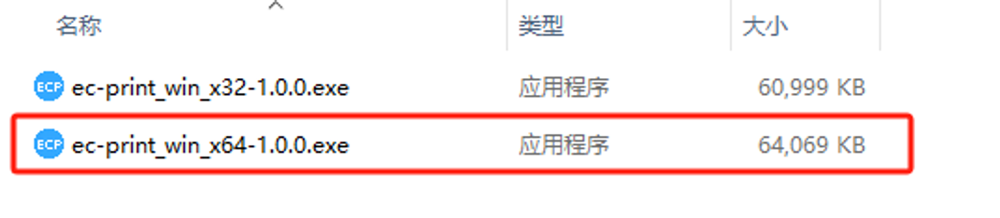
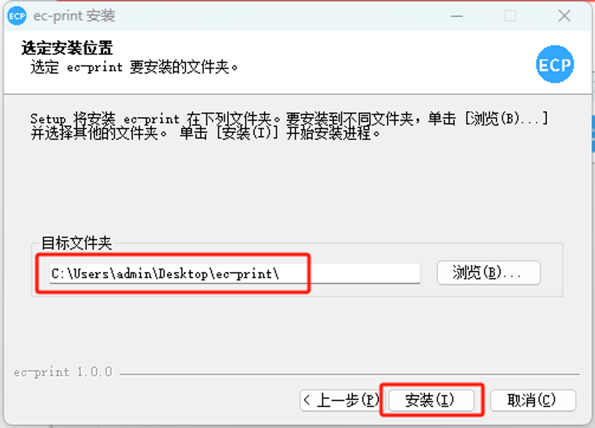
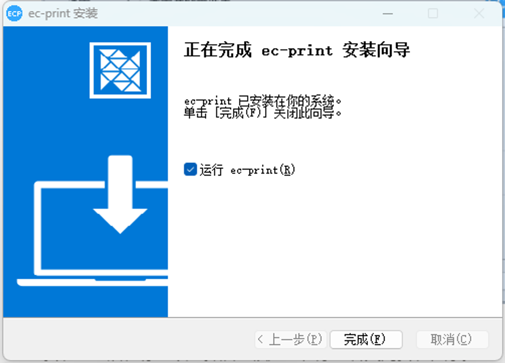
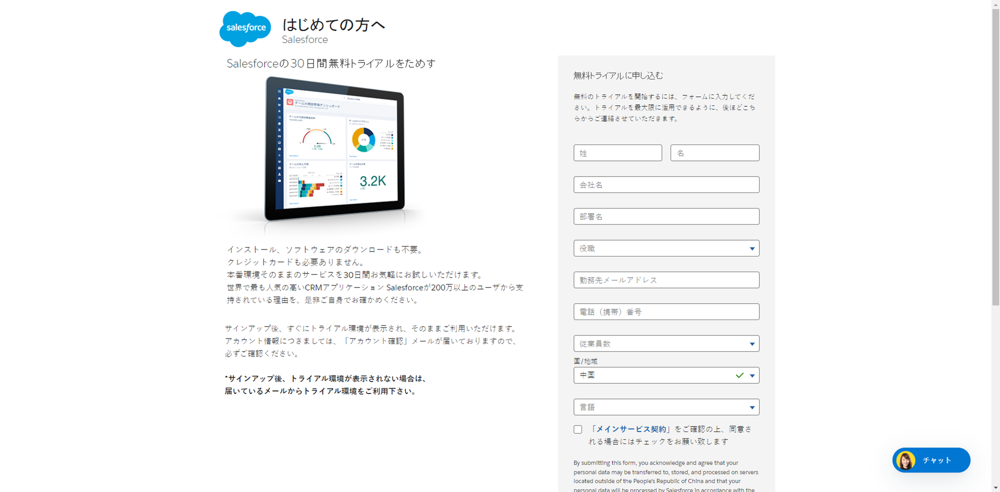

# EC-PRINT 安装指南

## 1. 下载安装包
- 访问 [EC-PRINT 官方网站](https://www.e-cloudsoft.com/print/index.html)下载安装包。
- 根据你本地电脑的适用类型选择相应的安装包进行下载。例如，如果你的电脑是Windows64位系统，则选择下载名为 `ec-print_win_x64-1.0.0.exe` 的安装包。
## 2. 安装应用程序
- 以下以`ec-print_win_x64-1.0.0.exe`版本的安装包进行举例

- 双击下载的安装包文件 `ec-print_win_x64-1.0.0.exe`。

- 选择安装用户，根据你的具体情况选择要安装该应用的用户。

- 选择安装文件夹，在此步骤中，你可以选择安装该应用程序的位置。

- 点击“安装”开始安装过程。
- 安装完成后，你可以选择启动该应用程序或者关闭安装程序。

# **Salesforce 注册**

## 1.**访问 Salesforce 注册页面**

- 打开您的 Web 浏览器，导航至 Salesforce 注册页面。
- 注册页面通常可以在 Salesforce 官方网站上找到。

## 2.**选择注册类型**

- 在注册页面上，您将看到两个主要选项：企业用户和个人用户。
- 如果您是企业或团队，请选择“企业用户”选项。
- 如果您是个人用户，请选择“个人用户”选项。

## 3.**填写注册表格**

### **企业用户：**

- 输入您的企业名称。
- 提供您的业务电子邮件地址。
- 设置并确认您的密码。
- 输入其他所需的企业相关信息。

### **个人用户：**

- 提供您的个人信息，包括姓名和电子邮件地址。
- 设置并确认您的密码。
- 输入其他所需的个人信息。

## 4.**验证您的信息**

- 在填写注册表格后，您可能需要进行身份验证。
- Salesforce 可能会向您提供的电子邮件地址发送一封验证邮件。
- 打开邮件并按照其中的说明完成验证过程。

## 5.**同意条款和条件**

- 在注册过程中，您将需要同意 Salesforce 的服务条款和隐私政策。
- 仔细阅读相关条款，并勾选同意框。

## 6.**完成注册**

- 点击注册页面上的“注册”或类似按钮，以提交您的注册信息。
- 如果一切顺利，您将被重定向到您的 Salesforce 帐户的欢迎页面。

## 7.登录 **Salesforce**

- 一旦注册成功，您可以登录到您的 Salesforce 帐户。

## **常见问题和支持**

- 如果在注册过程中遇到任何问题，请参考 Salesforce 官方文档或联系 Salesforce 支持团队。
- 官方文档提供了有关平台的详细信息，教程和常见问题的解答。

# **注意事项**

- 在安装过程中，请确保你有足够的权限来安装该应用程序。
- 如果在安装过程中遇到任何问题，请联系技术支持获取帮助。

