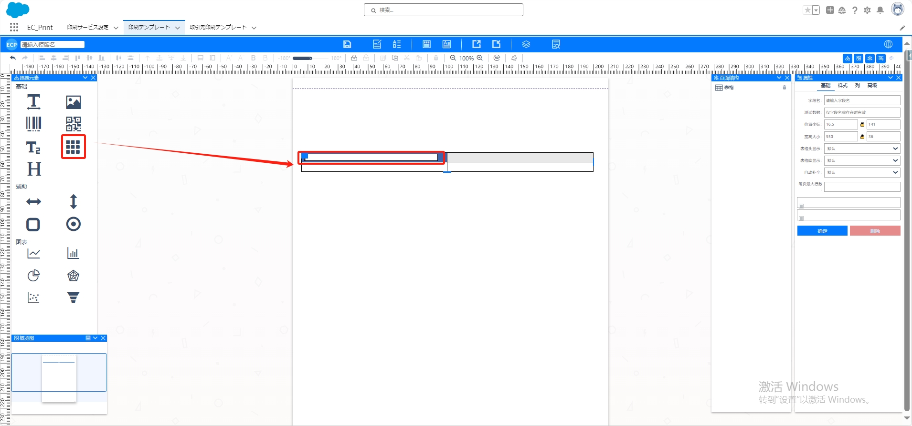
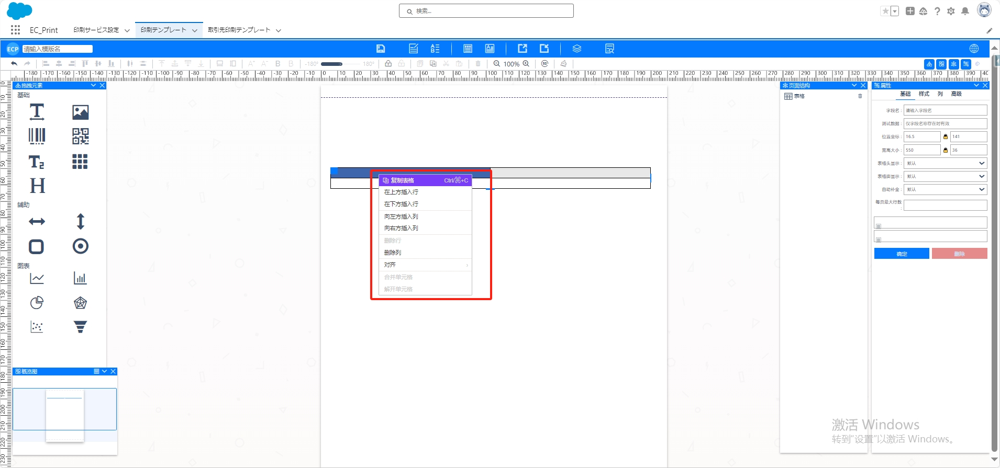
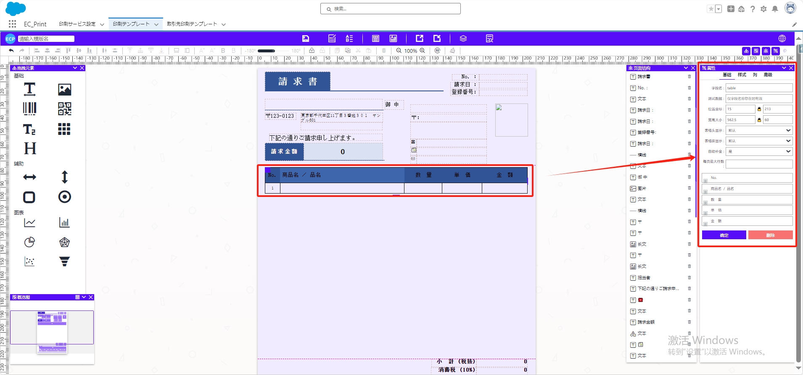
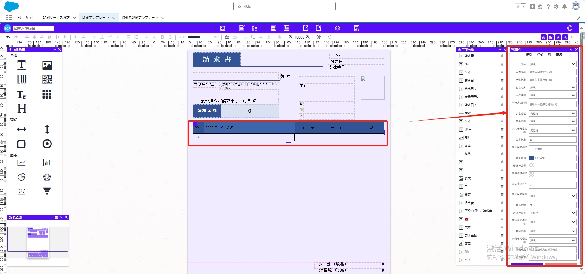
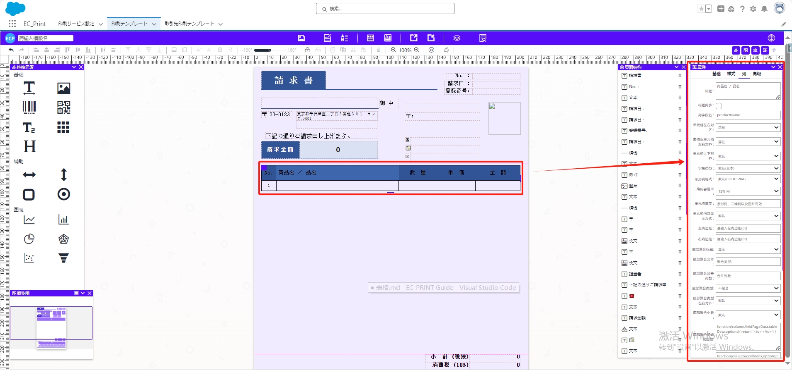
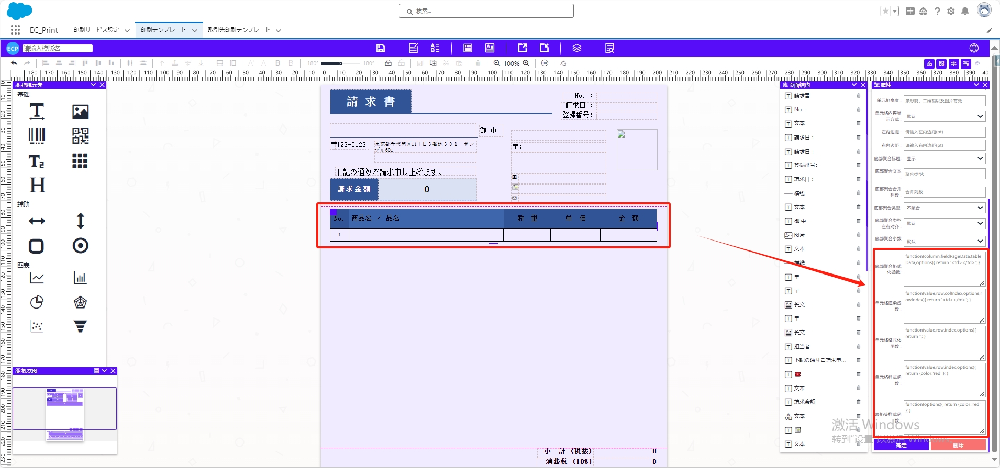
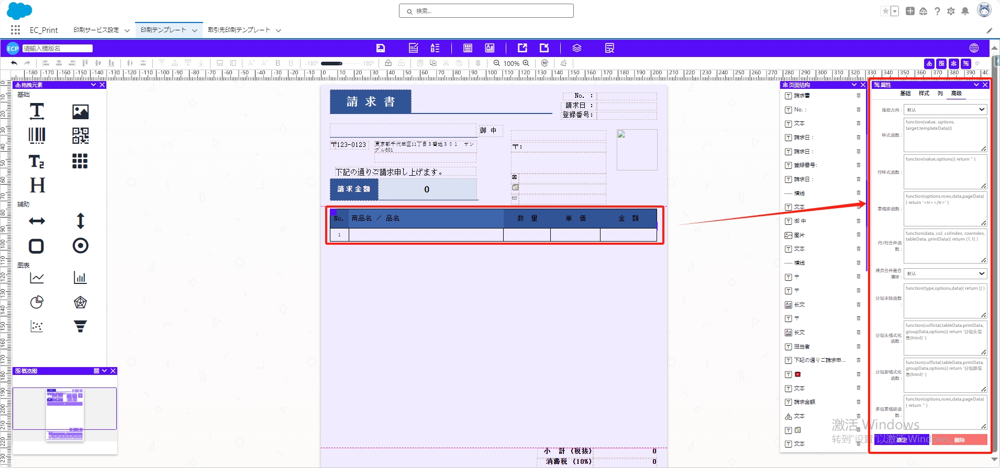

# 表格

## **拖拽与编辑**

- 将拖拽元素【表格】拖至中间模板位置。
- 双击表格的header部分可设置标题。

### 右键表格进行操作

- 复制表格
- 在上下方插入行。
- 在左右方插入列。
- 删除列。
- 删除行。
- 对齐
- 合并单元格。
- 解开单元格。

## 属性值设置

### 一、基础属性

- **字段名：** 指定表格的字段名称。
- **测试数据：** 输入测试数据以预览表格效果(仅字段名存在时生效)。
- **位置坐标、宽高大小：** 调整表格的位置和尺寸。
- **表格头显示、表格脚显示：** 控制是否显示表格头和表格脚。
- **自动补全：** 启用自动补全功能。
- **每页最大行数：** 设置每页显示的最大行数。

### 二、样式属性

- **字体、字体大小、字体行高：** 设置表格文本的字体属性。
- **左右对齐：** 调整表格文本的水平对齐方式。
- **一行多组、一行多组间隔：** 支持一行显示多组数据及其间隔。
- **表格边框、表头边框、表头单元格边框、边框、表头行高、表头背景、表头字体大小、表头字体粗细、表体行高、表体行边框、表体单元格边框、表尾边框、表尾单元格边框、最低高度：** 定义表格的样式。

### 三、列属性

- **标题、标题同步、列字段名：** 针对每列进行标题和字段名的设置。
- **单元格左右对齐、表格头单元格左右对齐、单元格上下对齐：** 控制文本在单元格中的对齐方式。
- **字段类型：** 指定数据类型，如文本、序号等。
- **条形码格式、二维码容错率：** 针对特定列的条形码和二维码设置。
- **单元格高度、左内边距、右内边距：** 调整单元格的高度和内边距。
- **底部聚合标题、底部聚合文本、底部聚合合并列数、底部聚合类型左右对齐、底部聚合小数、底部聚合格式化函数、单元格渲染函数、单元格格式化函数、单元格样式函数、表格头样式函数：** 提供丰富的列级别属性设置。

### 四、高级属性

- **拖动方向：** 指定表格的拖动方向。
- **样式函数、行样式函数、表格脚函数、行/列合并函数、跨页合并是否清除、分组字段函数、分组头格式化函数、分组脚格式化函数、多组表格脚函数：** 提供高级属性，支持更复杂的表格定制需求。

