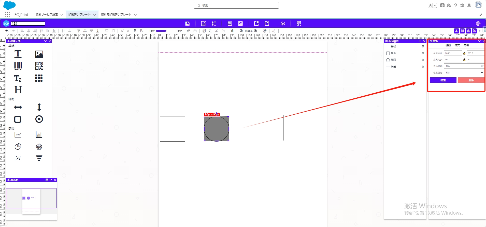
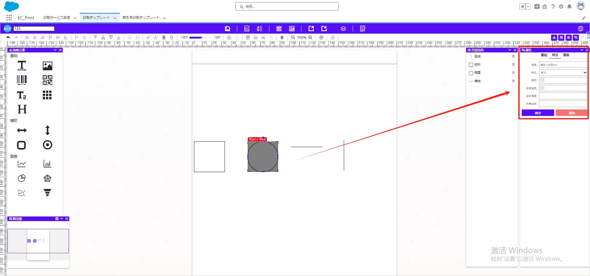
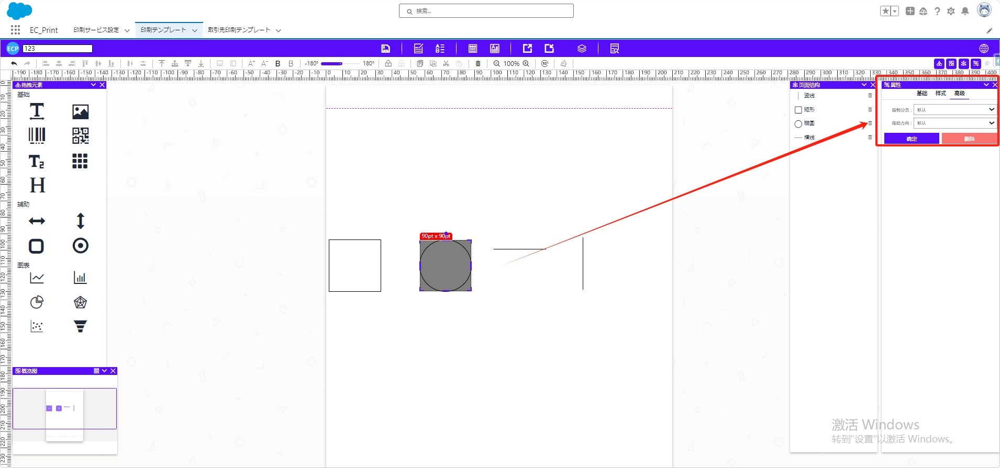

# 辅助(横线、竖线等)

## **拖拽与编辑**

- 将辅助中的元素拖拽至中间模板位置。
- **拖动显示区域**调整大小。

## 属性值设置

### 一、基础属性

- **坐标位置、宽度大小**：调整元素的坐标位置和宽度大小。
- **显示规则：**设置元素的显示规则。
- **位置固定：**设定元素是否固定在某个位置。

### 二、样式属性

- **线宽：**边框线的大小。
- **样式：**设置实线、长虚线或短虚线。
- **颜色、背景颜色：** 调整元素的背景颜色和边框颜色。
- **旋转角度、元素层级：**设置元素行高、旋转角度以及元素的图层叠放顺序。

### 三、高级属性

- **强制分页：** 控制元素是否强制在页面中单独显示。
- **拖动方向：** 设定元素可拖动的方向。

