# 面板

<aside>
💡 所有打印元素实际存储的位置都在面板中。可以理解成 `“模板”` 是画框，`“面板”` 才是真正的画布。

</aside>

## **拖拽元素区域**

- 左侧中间区域是用于拖拽元素的区域，包含以下元素：文本、图片、表格、html、条形码、二维码、折线图、柱状图、饼图等元素。

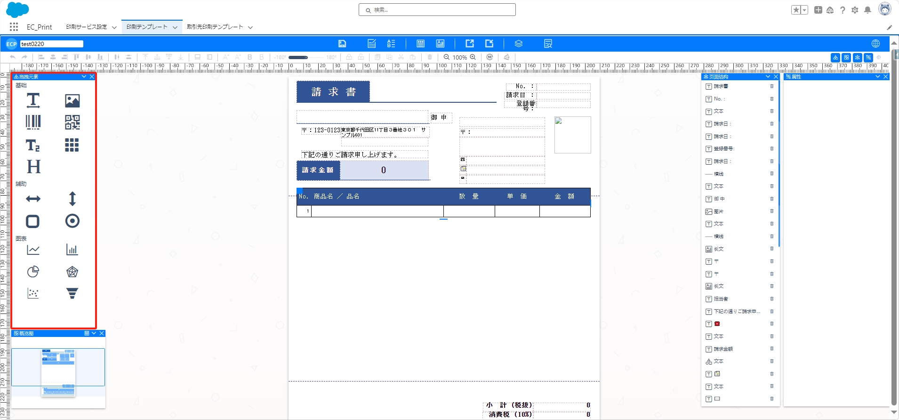
## **模板概览**

- 左侧下方区域是模板的概览图，提供两种预览模式：概况模式和原始模式

### 概况模式

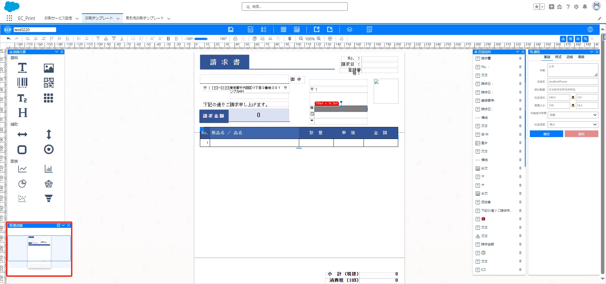
### 原始模式

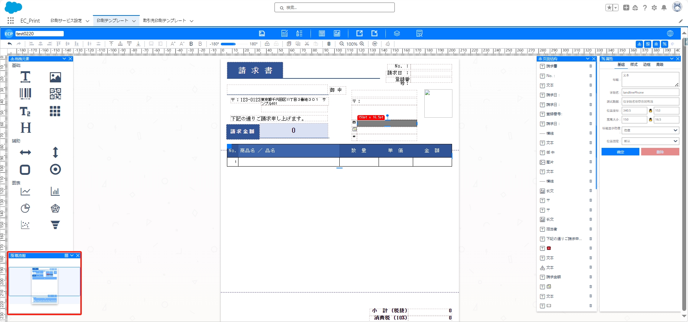
## **基本功能**

- 在上方工具栏，提供以下基本功能：放大、缩小、克隆、复制、剪切、置于顶层、置于底层、字体加粗，字体加大、旋转等。

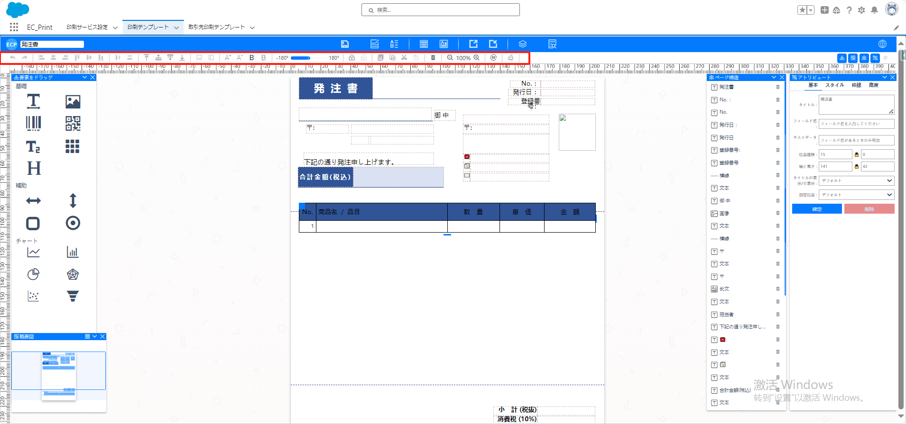
## **模板区域**

- 中间区域为模板区域，包含所有拖拽的元素。点击模板区域可在属性中设置：纸张大小、打印规则、打印方向、背景颜色、添加水印等功能。

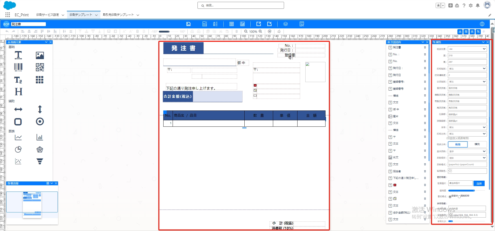
## **页面结构**

- 模板右侧是页面结构，包含所有模板元素的名称。可一览模板元素列表，点击删除按钮可删除模板中的元素。

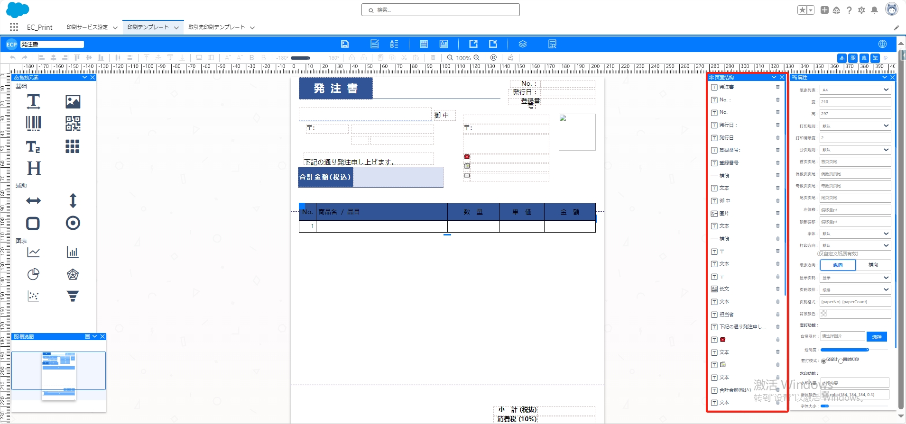
## **属性设置**

- 右侧位置是属性设置，点击模板中的元素可进行详细设置，包括：基础属性、样式、边框、高级属性

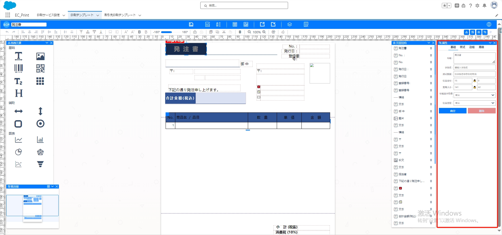
<!-- ## 位置交换

- 在位置交换设置中，选择两个元素，可以进行交换位置的操作

[] -->
## **保存与导出**

- 上方功能栏提供以下功能：保存、编辑模板数据、编辑打印数据、导出到本地文件、从本地文件导入模板、查看json数据模型、查看Apex Class数据模型、预览、切换语言等功能。

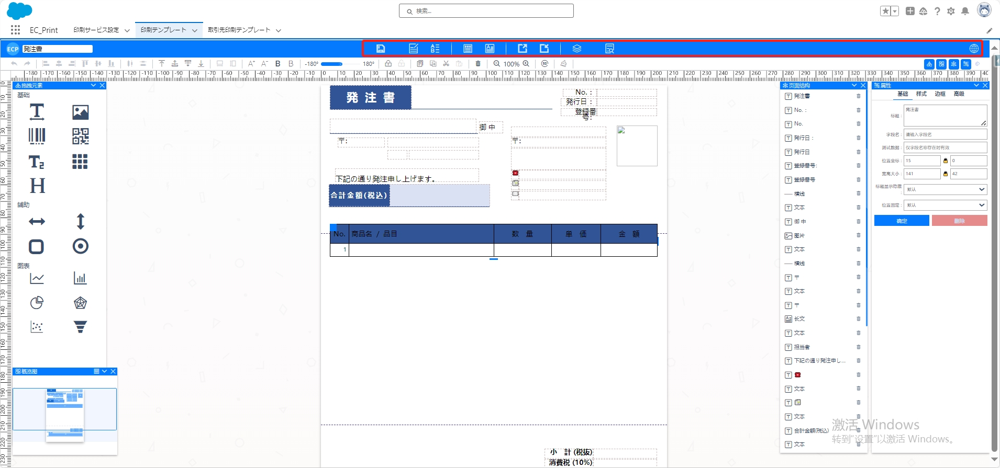
- 点击编辑模板数据、编辑打印数据、查看json数据模型、查看Apex Class数据，弹出编辑模板框进行编辑

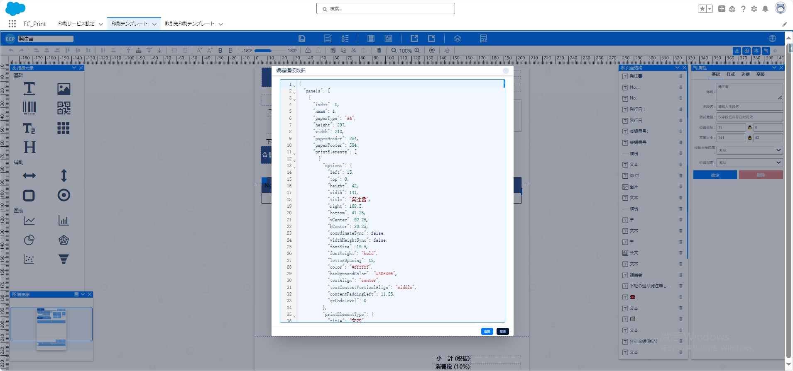
# **预览与打印**

- 点击上方预览按钮，弹出基于当前模板设置生成的预览图，可进行：导出为 PDF、直接打印、浏览器打印功能

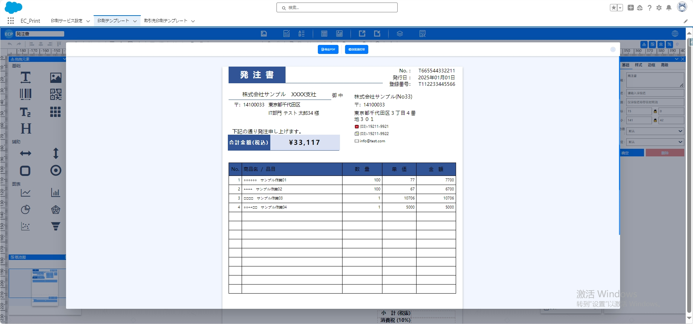

# 工具栏

- 点击工具栏中的图标，进行显示或者隐藏组件

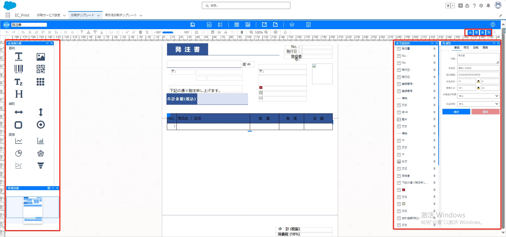
- 点击工具栏中最右侧的的主题，可以更换编辑模板页面的主题

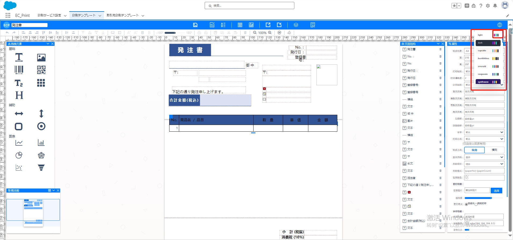

# **快捷操作**

- 左上方输入框可输入当前保存的模板名称，使用快捷键 Ctrl+S 进行保存。

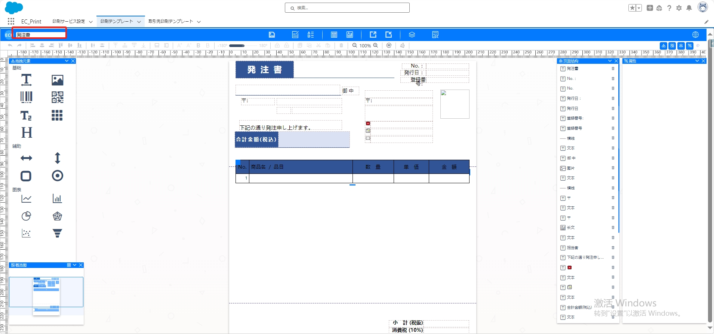
- 页面中使用快捷键：Ctrl+S 进行保存,Ctrl+Z 进行回退, Delete 键删除元素,上下左右键微调元素位置等功能