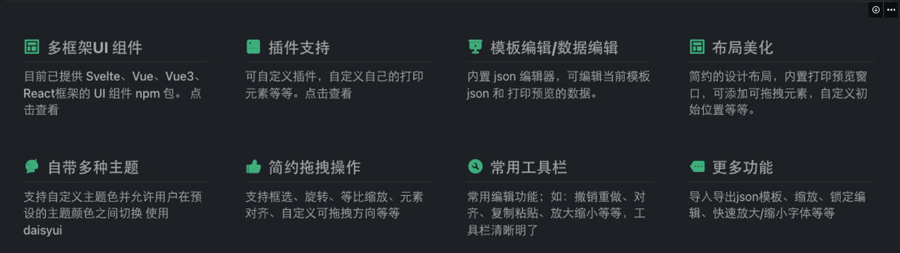
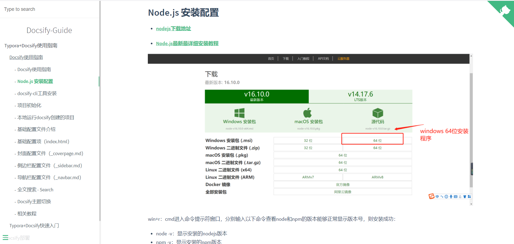

# EC-PRINT
> 🐱‍🏍EC-PRINT使用指南，低成本，高效率的轻量报表设计器。

- [打印客户端下载(Window X64位)](https://www.e-cloudsoft.com/print/index.html)

## 快速开始
- [环境准备](/ProjectDocs/环境准备.md)
- [本地打印设定方法](https://docsify.js.org/#/zh-cn/quickstart)
- [云端打印设定方法](https://www.cnblogs.com/throwable/p/13605289.html)
- [常见问题](https://www.cnblogs.com/Can-daydayup/p/15413267.html)

## 模板设计器使用手册
- [开始](https://www.cnblogs.com/Can-daydayup/p/15779788.html)
- [面板](https://docsify.js.org/#/zh-cn/deploy?id=github-pages)
- [文本](https://docsify.js.org/#/zh-cn/deploy?id=gitlab-pages)
- [图片](https://docsify.js.org/#/zh-cn/deploy?id=gitee-pages)
- [表格](https://docsify.js.org/#/zh-cn/deploy?id=docker)
- [HTML](https://docsify.js.org/#/zh-cn/deploy?id=firebase-主机)
- [条形码&二维码](https://docsify.js.org/#/zh-cn/deploy?id=vps)
- [图表](https://docsify.js.org/#/zh-cn/deploy?id=netlify)
- [辅助（横线、竖线等）](https://docsify.js.org/#/zh-cn/deploy?id=zeit-now)

<!-- 

 -->

## 联系我们